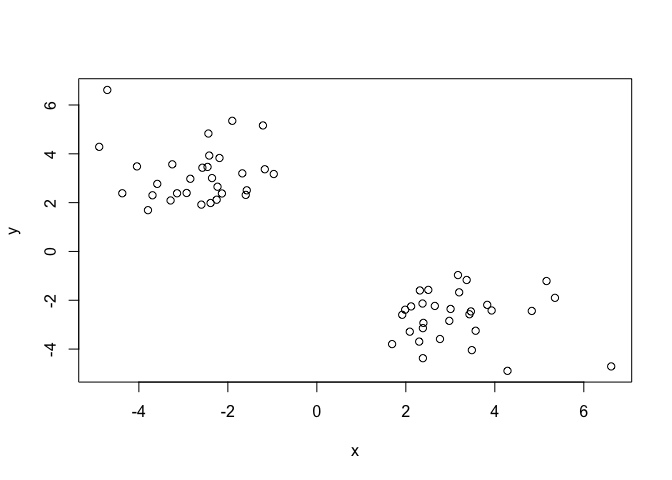
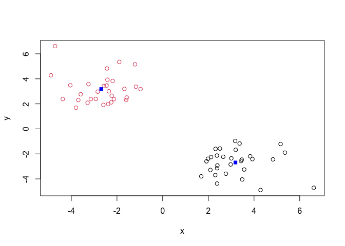
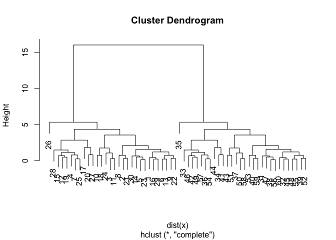
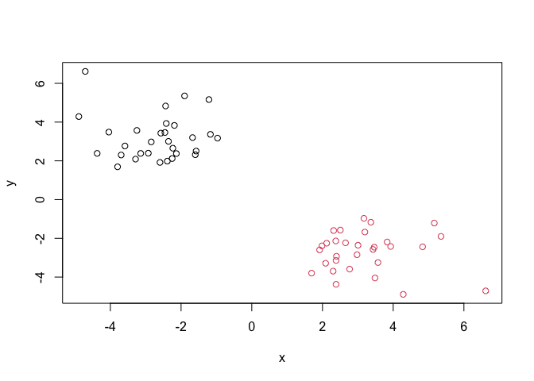
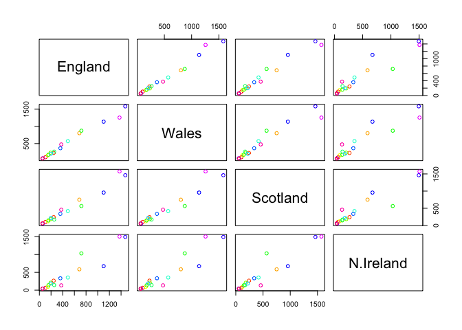
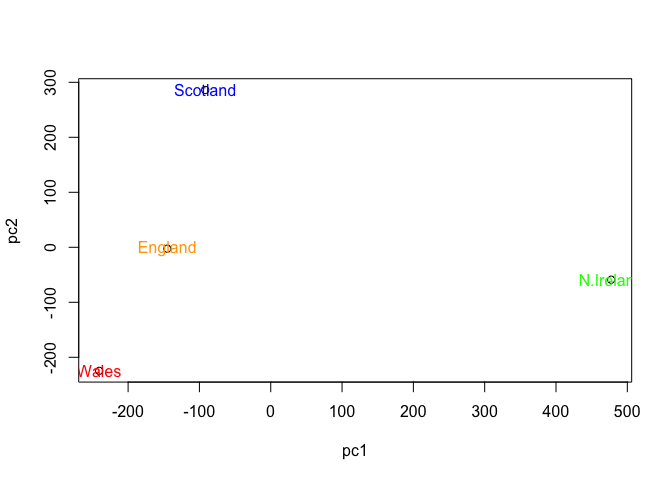
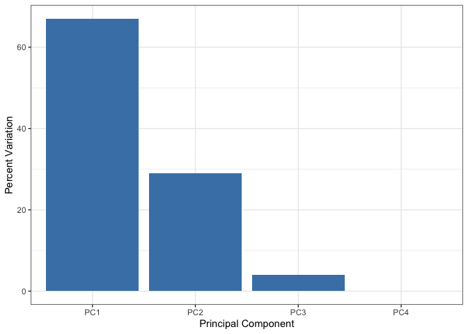
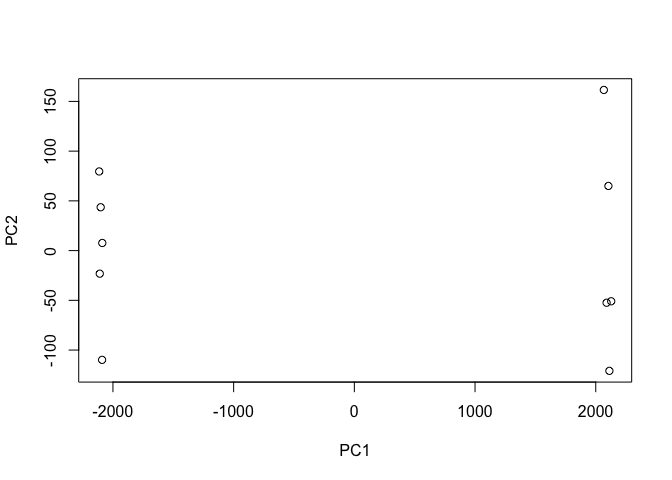
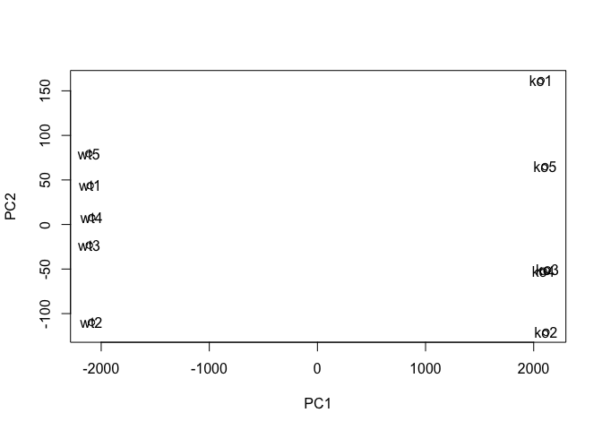

# Class07
Brooke Clements (PID: A17532793)
Invalid Date

\#First up kmeans()

Deom of using kmeans() function in base R. First make up some data with
a known structure.

``` r
tmp <- c(rnorm(30,-3), rnorm(30,3))
x <- cbind(x=tmp,y=rev(tmp))
x
```

                   x          y
     [1,] -2.5952390  1.9185629
     [2,] -1.1691673  3.3676401
     [3,] -2.1881636  3.8293558
     [4,] -3.5869237  2.7677001
     [5,] -2.4565690  3.4629779
     [6,] -1.5976821  2.3158105
     [7,] -3.1418566  2.3835163
     [8,] -1.6750330  3.1989068
     [9,] -2.1335457  2.3755182
    [10,] -1.2113597  5.1624514
    [11,] -2.4183722  3.9285895
    [12,] -3.2872589  2.0889538
    [13,] -1.5747470  2.5048710
    [14,] -2.3557856  3.0057812
    [15,] -3.7953634  1.6913242
    [16,] -2.3881124  1.9847929
    [17,] -4.8914786  4.2850809
    [18,] -1.9007492  5.3518547
    [19,] -3.6937414  2.3006064
    [20,] -4.0427218  3.4843195
    [21,] -0.9677176  3.1721065
    [22,] -2.2326708  2.6519770
    [23,] -2.5728830  3.4299898
    [24,] -2.4372859  4.8312375
    [25,] -2.9262584  2.3951350
    [26,] -4.7098538  6.6159760
    [27,] -3.2487292  3.5692218
    [28,] -4.3727072  2.3838257
    [29,] -2.2513441  2.1188653
    [30,] -2.8435597  2.9770187
    [31,]  2.9770187 -2.8435597
    [32,]  2.1188653 -2.2513441
    [33,]  2.3838257 -4.3727072
    [34,]  3.5692218 -3.2487292
    [35,]  6.6159760 -4.7098538
    [36,]  2.3951350 -2.9262584
    [37,]  4.8312375 -2.4372859
    [38,]  3.4299898 -2.5728830
    [39,]  2.6519770 -2.2326708
    [40,]  3.1721065 -0.9677176
    [41,]  3.4843195 -4.0427218
    [42,]  2.3006064 -3.6937414
    [43,]  5.3518547 -1.9007492
    [44,]  4.2850809 -4.8914786
    [45,]  1.9847929 -2.3881124
    [46,]  1.6913242 -3.7953634
    [47,]  3.0057812 -2.3557856
    [48,]  2.5048710 -1.5747470
    [49,]  2.0889538 -3.2872589
    [50,]  3.9285895 -2.4183722
    [51,]  5.1624514 -1.2113597
    [52,]  2.3755182 -2.1335457
    [53,]  3.1989068 -1.6750330
    [54,]  2.3835163 -3.1418566
    [55,]  2.3158105 -1.5976821
    [56,]  3.4629779 -2.4565690
    [57,]  2.7677001 -3.5869237
    [58,]  3.8293558 -2.1881636
    [59,]  3.3676401 -1.1691673
    [60,]  1.9185629 -2.5952390

``` r
plot(x)
```



Now we have some made up data in `x` let’s see how kmeans works with
this data

``` r
k <- kmeans(x,centers=2, nstart=20)
k
```

    K-means clustering with 2 clusters of sizes 30, 30

    Cluster means:
              x         y
    1  3.185132 -2.688896
    2 -2.688896  3.185132

    Clustering vector:
     [1] 2 2 2 2 2 2 2 2 2 2 2 2 2 2 2 2 2 2 2 2 2 2 2 2 2 2 2 2 2 2 1 1 1 1 1 1 1 1
    [39] 1 1 1 1 1 1 1 1 1 1 1 1 1 1 1 1 1 1 1 1 1 1

    Within cluster sum of squares by cluster:
    [1] 68.89464 68.89464
     (between_SS / total_SS =  88.3 %)

    Available components:

    [1] "cluster"      "centers"      "totss"        "withinss"     "tot.withinss"
    [6] "betweenss"    "size"         "iter"         "ifault"      

> Q. How many points are in cluster?

``` r
k$size
```

    [1] 30 30

> Q. How do we get to the cluster membership/assignment?

``` r
k$cluster
```

     [1] 2 2 2 2 2 2 2 2 2 2 2 2 2 2 2 2 2 2 2 2 2 2 2 2 2 2 2 2 2 2 1 1 1 1 1 1 1 1
    [39] 1 1 1 1 1 1 1 1 1 1 1 1 1 1 1 1 1 1 1 1 1 1

> Q. What about cluster centers?

``` r
k$centers
```

              x         y
    1  3.185132 -2.688896
    2 -2.688896  3.185132

Now we got to the main results let’s use them to plot our data with the
kmeans results.

``` r
plot(x, col=k$cluster)
points(k$centers, col="blue", pch=15)
```



## Now for Hierarchical Clustering

We will cluster the same data`x` with the `hclust()`. In this case
`hclust()` requires a distance matrix as input.

``` r
hc <- hclust(dist(x))
hc
```


    Call:
    hclust(d = dist(x))

    Cluster method   : complete 
    Distance         : euclidean 
    Number of objects: 60 

Let’s plot our hclust result

``` r
plot(hc)
```



To get cluster membership vector we need to “cut” the tree with the
`cutree()`

``` r
grps <- cutree(hc, h=8)
grps
```

     [1] 1 1 1 1 1 1 1 1 1 1 1 1 1 1 1 1 1 1 1 1 1 1 1 1 1 1 1 1 1 1 2 2 2 2 2 2 2 2
    [39] 2 2 2 2 2 2 2 2 2 2 2 2 2 2 2 2 2 2 2 2 2 2

Now plot our data with hclust() results.

``` r
plot(x, col=grps)
```



# Principal Component Analysis (PCA)

## PCA of UK food data

Read data from website and try a few visualizations.

``` r
url <- "https://tinyurl.com/UK-foods"
x <- read.csv(url, row.names=1)
x
```

                        England Wales Scotland N.Ireland
    Cheese                  105   103      103        66
    Carcass_meat            245   227      242       267
    Other_meat              685   803      750       586
    Fish                    147   160      122        93
    Fats_and_oils           193   235      184       209
    Sugars                  156   175      147       139
    Fresh_potatoes          720   874      566      1033
    Fresh_Veg               253   265      171       143
    Other_Veg               488   570      418       355
    Processed_potatoes      198   203      220       187
    Processed_Veg           360   365      337       334
    Fresh_fruit            1102  1137      957       674
    Cereals                1472  1582     1462      1494
    Beverages                57    73       53        47
    Soft_drinks            1374  1256     1572      1506
    Alcoholic_drinks        375   475      458       135
    Confectionery            54    64       62        41

> Q1. How many rows and columns are in your new data frame named x? What
> R functions could you use to answer this questions?

``` r
dim(x)
```

    [1] 17  4

Preview the first 6 rows

``` r
head(x)
```

                   England Wales Scotland N.Ireland
    Cheese             105   103      103        66
    Carcass_meat       245   227      242       267
    Other_meat         685   803      750       586
    Fish               147   160      122        93
    Fats_and_oils      193   235      184       209
    Sugars             156   175      147       139

> Q2. Which approach to solving the ‘row-names problem’ mentioned above
> do you prefer and why? Is one approach more robust than another under
> certain circumstances?

I prefer `read.csv(url, row.names=1)`because it sets it up from the
begining and it not forgoten later.

> Q3: Changing what optional argument in the above barplot() function
> results in the following plot?

``` r
cols <- rainbow(nrow(x))
barplot(as.matrix(x),col=cols)
```


``` r
barplot(as.matrix(x),col=cols, beside = TRUE)
```


## Using ggplot and the need for “tidy” data (Optional)

Convert data to long format for ggplot with `pivot_longer()`

``` r
library(tidyr)

x_long <- x |> 
          tibble::rownames_to_column("Food") |> 
          pivot_longer(cols = -Food, 
                       names_to = "Country", 
                       values_to = "Consumption")

dim(x_long)
```

    [1] 68  3

``` r
head(x_long)
```

    # A tibble: 6 × 3
      Food            Country   Consumption
      <chr>           <chr>           <int>
    1 "Cheese"        England           105
    2 "Cheese"        Wales             103
    3 "Cheese"        Scotland          103
    4 "Cheese"        N.Ireland          66
    5 "Carcass_meat " England           245
    6 "Carcass_meat " Wales             227

# Create grouped bar plot

``` r
library(ggplot2)
ggplot(x_long) +
  aes(x = Country, y = Consumption, fill = Food) +
  geom_col(position = "dodge") +
  theme_bw()
```


> Q4: Changing what optional argument in the above ggplot() code results
> in a stacked barplot figure?

``` r
ggplot(x_long) +
  aes(x = Country, y = Consumption, fill = Food) +
  geom_col(position = "stack") +
  theme_bw()
```


> Q5: We can use the pairs() function to generate all pairwise plots for
> our countries. Can you make sense of the following code and resulting
> figure? What does it mean if a given point lies on the diagonal for a
> given plot?

``` r
pairs(x, col=cols)
```



``` r
library(pheatmap)
url <- "https://tinyurl.com/UK-foods"
x <- read.csv(url, row.names=1)
pheatmap(as.matrix(x))
```


> Q6. Based on the pairs and heatmap figures, which countries cluster
> together and what does this suggest about their food consumption
> patterns? Can you easily tell what the main differences between N.
> Ireland and the other countries of the UK in terms of this data-set?

Scotland, England, and Wales cluster together while N. Ireland. This
suggest that Scotland, England, and Wales have similar food consumption
patterns. We can easily tell that N. Ireland is different based on how
the other counties have similar color palletes.

PCA to the rescue!! The main base R PCA function is called`prcomp()` and
we will need to give it the transpose of our input data!

``` r
pca <- prcomp(t(x))
```

There is a nice summary of how well PCA is doing

``` r
summary(pca)
```

    Importance of components:
                                PC1      PC2      PC3     PC4
    Standard deviation     324.1502 212.7478 73.87622 2.7e-14
    Proportion of Variance   0.6744   0.2905  0.03503 0.0e+00
    Cumulative Proportion    0.6744   0.9650  1.00000 1.0e+00

``` r
attributes(pca)
```

    $names
    [1] "sdev"     "rotation" "center"   "scale"    "x"       

    $class
    [1] "prcomp"

> Q7. Complete the code below to generate a plot of PC1 vs PC2. The
> second line adds text labels over the data points.

To make our new PCA plot (a.k.a PCA score plot)we acces `pca$x`

\#Create a data frame for plotting

``` r
df <- as.data.frame(pca$x)
df$Country <- rownames(df)
```

\#Plot PC1 vs PC2 with ggplot

``` r
ggplot(pca$x) +
  aes(x = PC1, y = PC2, label = rownames(pca$x)) +
  geom_point(size = 3) +
  geom_text(vjust = -0.5) +
  xlim(-270, 500) +
  xlab("PC1") +
  ylab("PC2") +
  theme_bw()
```


> Q8. Customize your plot so that the colors of the country names match
> the colors in our UK and Ireland map and table at start of this
> document.

Color up the plot

``` r
country_cols <- c("orange","red","blue","green")
plot(pca$x[,1],pca$x[,2],xlab="pc1",ylab="pc2")
text(pca$x[,1],pca$x[,2], colnames(x), col=country_cols)
```



Here we can caculate how much variation is in the original data that
each PC accounts for

``` r
v <- round( pca$sdev^2/sum(pca$sdev^2) * 100 )
v
```

    [1] 67 29  4  0

\#Create scree plot with ggplot

``` r
variance_df <- data.frame(
  PC = factor(paste0("PC", 1:length(v)), levels = paste0("PC", 1:length(v))),
  Variance = v
)

ggplot(variance_df) +
  aes(x = PC, y = Variance) +
  geom_col(fill = "steelblue") +
  xlab("Principal Component") +
  ylab("Percent Variation") +
  theme_bw() +
  theme(axis.text.x = element_text(angle = 0))
```



## Digging deeper (variable loadings)

Lets focus on PC1 as it accounts for \> 90% of variance

``` r
ggplot(pca$rotation) +
  aes(x = PC1, 
      y = reorder(rownames(pca$rotation), PC1)) +
  geom_col(fill = "steelblue") +
  xlab("PC1 Loading Score") +
  ylab("") +
  theme_bw() +
  theme(axis.text.y = element_text(size = 9))
```


> Q9: Generate a similar ‘loadings plot’ for PC2. What two food groups
> feature prominantely and what does PC2 maninly tell us about?

``` r
ggplot(pca$rotation) +
  aes(x = PC2, 
      y = reorder(rownames(pca$rotation), PC2)) +
  geom_col(fill = "steelblue") +
  xlab("PC2 Loading Score") +
  ylab("") +
  theme_bw() +
  theme(axis.text.y = element_text(size = 9))
```


Here we see that fresh potatoes and soft drinks are the two groups that
are feature prominently. This tells us that in PC2 more soft drinks are
consumed when compared to potatoes.

## PCA of RNA-seq data

Read in data from website

``` r
url2 <- "https://tinyurl.com/expression-CSV"
rna.data <- read.csv(url2, row.names=1)
head(rna.data)
```

           wt1 wt2  wt3  wt4 wt5 ko1 ko2 ko3 ko4 ko5
    gene1  439 458  408  429 420  90  88  86  90  93
    gene2  219 200  204  210 187 427 423 434 433 426
    gene3 1006 989 1030 1017 973 252 237 238 226 210
    gene4  783 792  829  856 760 849 856 835 885 894
    gene5  181 249  204  244 225 277 305 272 270 279
    gene6  460 502  491  491 493 612 594 577 618 638

``` r
pca <- prcomp(t(rna.data))
summary(pca)
```

    Importance of components:
                                 PC1     PC2      PC3      PC4      PC5      PC6
    Standard deviation     2214.2633 88.9209 84.33908 77.74094 69.66341 67.78516
    Proportion of Variance    0.9917  0.0016  0.00144  0.00122  0.00098  0.00093
    Cumulative Proportion     0.9917  0.9933  0.99471  0.99593  0.99691  0.99784
                                PC7      PC8      PC9      PC10
    Standard deviation     65.29428 59.90981 53.20803 2.852e-13
    Proportion of Variance  0.00086  0.00073  0.00057 0.000e+00
    Cumulative Proportion   0.99870  0.99943  1.00000 1.000e+00

Do our PCA plot of this RNA-seq data

``` r
plot(pca$x[,1], pca$x[,2], xlab="PC1", ylab="PC2")
```



``` r
plot(pca$x[,1], pca$x[,2], xlab="PC1", ylab="PC2")
text(pca$x[,1], pca$x[,2], colnames(rna.data))
```


