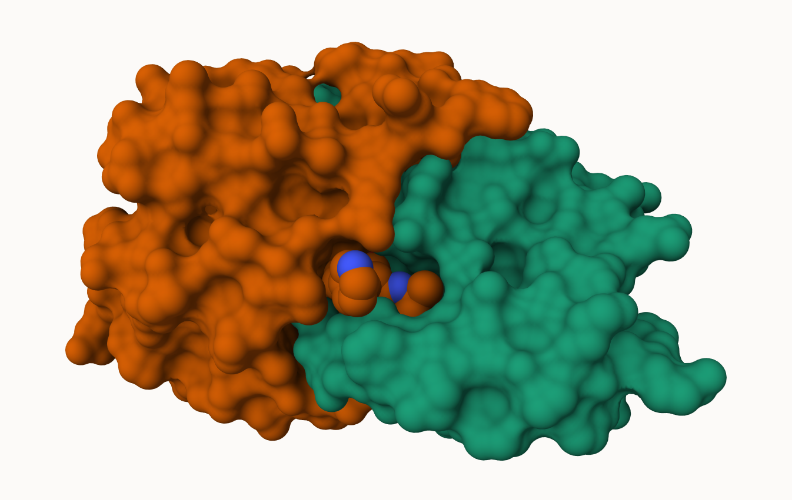

## PDB statistics

The protien Data Bank (PDB) is the main repository of biomolecular structures. Let's see what is contains: 


```{r}
stats <- read.csv("~/Downloads/pdb_stats.csv")
stats
```

```{r}
stats$X.ray
```
```{r}
sum(stats$Neutron)
```

The comma in these number leads to the numbers being read as character

```{r}
c(100, 10, "barry")
```

```{r}
library(readr)
stats <- read_csv("~/Downloads/pdb_stats.csv")
stats
```
```{r}
n.xray <- sum(stats$`X-ray`)
#n.em <- 
n.total <-  sum(stats$Total)

n.xray/n.total
```

>Q1: What percentage of structures in the PDB are solved by X-Ray and Electron Microscopy.

```{r}
n.xray <- sum(stats$`X-ray`)
n.em <- sum(stats$`EM`)
n.total <-  sum(stats$Total)
(n.xray+n.em)/n.total
```

>Q2: What proportion of structures in the PDB are protein?

```{r}
protein.only <- c(214078)
protein.only/n.total
```

> Q3 -> Skip

## Visualizing the HIV-1 protease structure

we can use the Molstar viewer online: https://molstar.org/viewer/



A new clean image showing the catalytic ASP25 amino acids in both chains of the HIV-PR dimer along with the inhibitor and the all important active site water.


>Q4: Water molecules normally have 3 atoms. Why do we see just one atom per water molecule in this structure?

>Q5: There is a critical “conserved” water molecule in the binding site. Can you identify this water molecule? What residue number does this water molecule have

## Bio3D package for structural bioinformatics


```{r}
library(bio3d)
pdb <- read.pdb("1hsg" )
pdb
```

```{r}
head(pdb$atom)
```

```{r}
library(bio3dview)

view.pdb(pdb)
```

```{r}
library(bio3dview)
library(NGLVieweR)

view.pdb(pdb) |>
  setSpin()
```

```{r}
# Select the important ASP 25 residue
sele <- atom.select(pdb, resno=25)

# and highlight them in spacefill representation
view.pdb(pdb, cols=c("navy","teal"), 
         highlight = sele,
         highlight.style = "spacefill") |>
  setRock()
```


## Predicting functional motions of a single structure

Read an ADK structure from PDB database:

```{r}
adk <- read.pdb("6s36")
adk
```

```{r}
attributes(pdb)
```

```{r}
m <- nma(adk)
```
```{r}
plot(m)
```


Write out our results as a wee trajectory/movie of predicted motions:
```{r}
mktrj(m, file="adk_m7.pdb")
```


