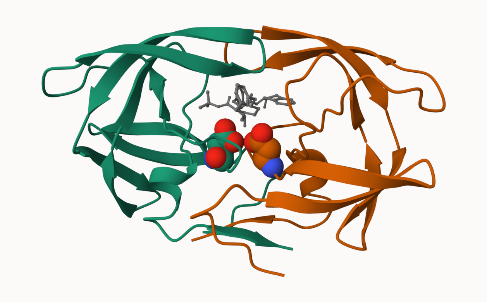

# Class10 Structural Bioinformatics Pt 1
Brooke Clements (PID:A17532793)

## PDB statistics

The protien Data Bank (PDB) is the main repository of biomolecular
structures. Let’s see what is contains:

``` r
stats <- read.csv("~/Downloads/pdb_stats.csv")
stats
```

               Molecular.Type   X.ray     EM    NMR Integrative Multiple.methods
    1          Protein (only) 178,795 21,825 12,773         343              226
    2 Protein/Oligosaccharide  10,363  3,564     34           8               11
    3              Protein/NA   9,106  6,335    287          24                7
    4     Nucleic acid (only)   3,132    221  1,566           3               15
    5                   Other     175     25     33           4                0
    6  Oligosaccharide (only)      11      0      6           0                1
      Neutron Other   Total
    1      84    32 214,078
    2       1     0  13,981
    3       0     0  15,759
    4       3     1   4,941
    5       0     0     237
    6       0     4      22

``` r
stats$X.ray
```

    [1] "178,795" "10,363"  "9,106"   "3,132"   "175"     "11"     

``` r
sum(stats$Neutron)
```

    [1] 88

The comma in these number leads to the numbers being read as character

``` r
c(100, 10, "barry")
```

    [1] "100"   "10"    "barry"

``` r
library(readr)
stats <- read_csv("~/Downloads/pdb_stats.csv")
```

    Rows: 6 Columns: 9
    ── Column specification ────────────────────────────────────────────────────────
    Delimiter: ","
    chr (1): Molecular Type
    dbl (4): Integrative, Multiple methods, Neutron, Other
    num (4): X-ray, EM, NMR, Total

    ℹ Use `spec()` to retrieve the full column specification for this data.
    ℹ Specify the column types or set `show_col_types = FALSE` to quiet this message.

``` r
stats
```

    # A tibble: 6 × 9
      `Molecular Type`    `X-ray`    EM   NMR Integrative `Multiple methods` Neutron
      <chr>                 <dbl> <dbl> <dbl>       <dbl>              <dbl>   <dbl>
    1 Protein (only)       178795 21825 12773         343                226      84
    2 Protein/Oligosacch…   10363  3564    34           8                 11       1
    3 Protein/NA             9106  6335   287          24                  7       0
    4 Nucleic acid (only)    3132   221  1566           3                 15       3
    5 Other                   175    25    33           4                  0       0
    6 Oligosaccharide (o…      11     0     6           0                  1       0
    # ℹ 2 more variables: Other <dbl>, Total <dbl>

``` r
n.xray <- sum(stats$`X-ray`)
#n.em <- 
n.total <-  sum(stats$Total)

n.xray/n.total
```

    [1] 0.8095077

> Q1: What percentage of structures in the PDB are solved by X-Ray and
> Electron Microscopy.

``` r
n.xray <- sum(stats$`X-ray`)
n.em <- sum(stats$`EM`)
n.total <-  sum(stats$Total)
(n.xray+n.em)/n.total
```

    [1] 0.937892

> Q2: What proportion of structures in the PDB are protein?

``` r
protein.only <- c(214078)
protein.only/n.total
```

    [1] 0.8596889

> Q3 -\> Skip

## Visualizing the HIV-1 protease structure

we can use the Molstar viewer online: https://molstar.org/viewer/


A new clean image showing the catalytic ASP25 amino acids in both chains
of the HIV-PR dimer along with the inhibitor and the all important
active site water.



> Q4: Water molecules normally have 3 atoms. Why do we see just one atom
> per water molecule in this structure?

> Q5: There is a critical “conserved” water molecule in the binding
> site. Can you identify this water molecule? What residue number does
> this water molecule have

## Bio3D package for structural bioinformatics

``` r
library(bio3d)
pdb <- read.pdb("1hsg" )
pdb
```


     Call:  read.pdb(file = "1hsg")

       Total Models#: 1
         Total Atoms#: 0,  XYZs#: 0  Chains#: 0  (values: )

         Protein Atoms#: 0  (residues/Calpha atoms#: 0)
         Nucleic acid Atoms#: 0  (residues/phosphate atoms#: 0)

         Non-protein/nucleic Atoms#: 0  (residues: 0)
         Non-protein/nucleic resid values: [ none ]

    + attr: atom, xyz, calpha, call

``` r
head(pdb$atom)
```

     [1] type   eleno  elety  alt    resid  chain  resno  insert x      y     
    [11] z      o      b      segid  elesy  charge
    <0 rows> (or 0-length row.names)

``` r
##library(bio3dview)

##view.pdb(pdb)
```

``` r
library(bio3d)
library(NGLVieweR)

NGLVieweR("model.pdb") |>
  setSpin()
```


``` r
# Select the important ASP 25 residue
sele <- atom.select(pdb, resno=25)

# and highlight them in spacefill representation
##NGLVieweR(pdb, cols=c("navy","teal"), 
        # highlight = sele,
         #highlight.style = "spacefill") |>
 # setRock()
```

## Predicting functional motions of a single structure

Read an ADK structure from PDB database:

``` r
adk <- read.pdb("6s36")
```

      Note: Accessing on-line PDB file
       PDB has ALT records, taking A only, rm.alt=TRUE

``` r
adk
```


     Call:  read.pdb(file = "6s36")

       Total Models#: 1
         Total Atoms#: 1898,  XYZs#: 5694  Chains#: 1  (values: A)

         Protein Atoms#: 1654  (residues/Calpha atoms#: 214)
         Nucleic acid Atoms#: 0  (residues/phosphate atoms#: 0)

         Non-protein/nucleic Atoms#: 244  (residues: 244)
         Non-protein/nucleic resid values: [ CL (3), HOH (238), MG (2), NA (1) ]

       Protein sequence:
          MRIILLGAPGAGKGTQAQFIMEKYGIPQISTGDMLRAAVKSGSELGKQAKDIMDAGKLVT
          DELVIALVKERIAQEDCRNGFLLDGFPRTIPQADAMKEAGINVDYVLEFDVPDELIVDKI
          VGRRVHAPSGRVYHVKFNPPKVEGKDDVTGEELTTRKDDQEETVRKRLVEYHQMTAPLIG
          YYSKEAEAGNTKYAKVDGTKPVAEVRADLEKILG

    + attr: atom, xyz, seqres, helix, sheet,
            calpha, remark, call

``` r
attributes(pdb)
```

    $names
    [1] "atom"   "xyz"    "calpha" "call"  

    $class
    [1] "pdb" "sse"

``` r
m <- nma(adk)
```

     Building Hessian...        Done in 0.017 seconds.
     Diagonalizing Hessian...   Done in 0.083 seconds.

``` r
plot(m)
```


Write out our results as a wee trajectory/movie of predicted motions:

``` r
mktrj(m, file="adk_m7.pdb")
```
